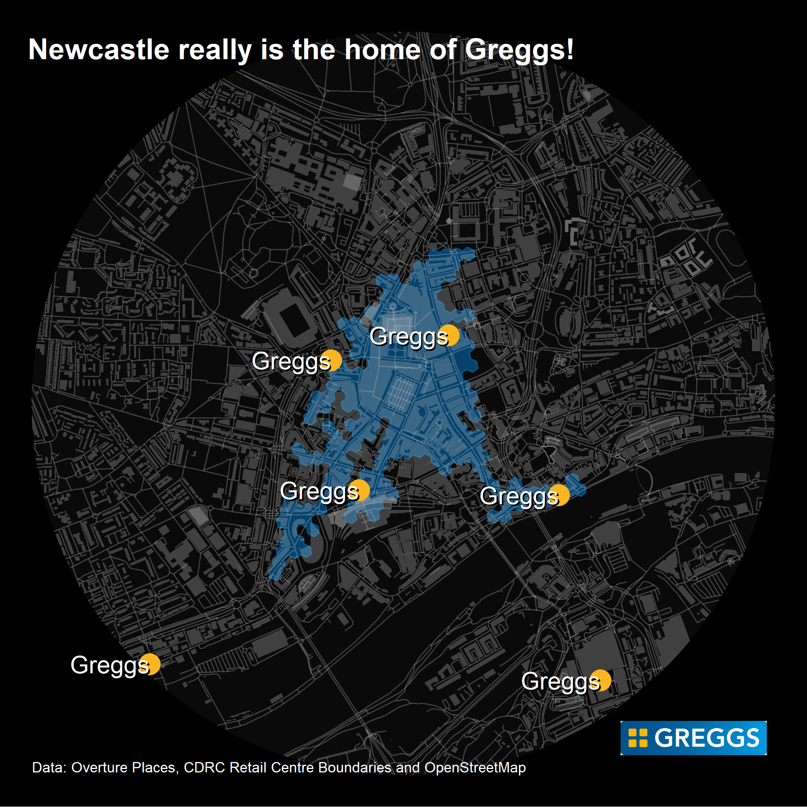

# 30DayMapChallenge-2023

## 2023 - Points 

Using new POI data from Overture, I mapped the locations of Greggs stores in the limits of Newcastle City Centre. This is based on recent work I have completed with colleague Cillian Berragan, where we have produced a processed version of Overture data for the UK. Our paper has been submitted for peer review, but is available to read as a preprint - LINK COMING SOON. 

The R code used to produce the map (tmap) can be found [here](https://github.com/patrickballantyne/30DayMapChallenge-2023/blob/main/Code.R).

   

  

